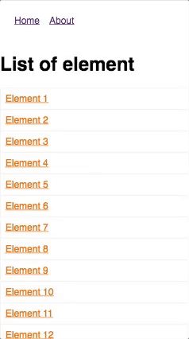
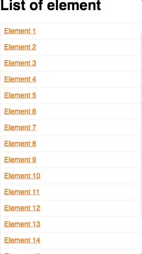

[](https://travis-ci.org/ipatate/react-router-scroll-memory)

### For React Router V4 only. React component to keep the scroll of the page and to restore it if the user clicks on the previous button of its browser

The React Router V4 has no concept of router middlewares. The package react-router-scroll not work with React Router V4.

You have solution in this page [https://reacttraining.com/react-router/web/guides/scroll-restoration](https://reacttraining.com/react-router/web/guides/scroll-restoration) for just scrolling to top on navigation on every transition. But if you click on the previous button, the page is also at the top even if you had scrolled on the page.

I did this package because I was frustrated that the new react router (4) does not restore the scroll when I click on the back button of my browser. By default, the component execute window.scrollTo(0,0), if the url not exist in memory.

only work with react and react router v4

#### Npm page

[https://www.npmjs.com/package/react-router-scroll-memory](https://www.npmjs.com/package/react-router-scroll-memory)

#### Installation

 * install package

    $ npm i -S react-router-scroll-memory


 * import component in your main page.

```javascript
import ScrollMemory from 'react-router-scroll-memory';
````

* add the component after the Router.

```jsx
  <BrowserRouter>
    <div>
      <ScrollMemory />
      <App />
    </div>
  </BrowserRouter>
```

#### Tested on Browser:

* Chrome
* Explorer 11
* Edge
* Safari
* Firefox

#### Online exemple

[https://simple-react-app-with-router.stackblitz.io](https://simple-react-app-with-router.stackblitz.io)

#### Screenshots
* Without the component
The scroll keep the position on transition and the scroll of new page is not to top.


* With the component
The new page is top and if i click previous, the scroll is restored.
